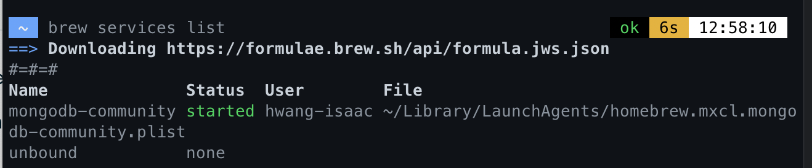
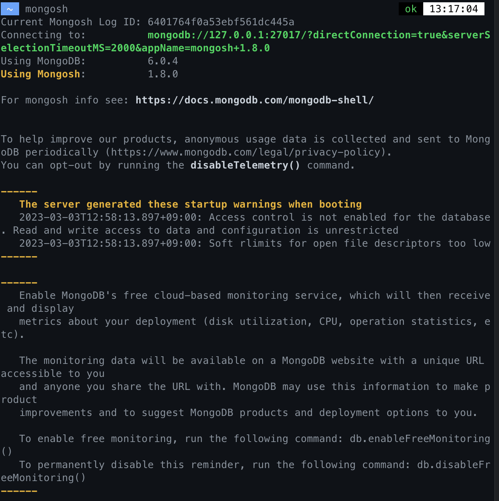
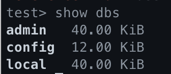

# Youtube clone

- NodeJS
- javascript
- Pug
- MongoDB

## 기능 및 컨셉

user

- User Authentication
- facebook login
- github login
- user profile
- log in
- log out

video

- video upload
- video recording
- search video
- AJAX comments
- view count

deploy

- Heroku
- S3 Upload
- Mongo Atlas

## MongoDB

> MongoDB 는 다목적, document-based, 분산 데이터베이스입니다.

- 장점: 배우고 사용하기 쉽습니다.

### document-base

일반적으로 DB 는 document-base 가 아니라 sql-base 입니다다.
mongoDB 는 document-base 이기 떄문에, 데이터를 object로 생각할 수 있습니다.

MongoDB는 NoSQL 데이터베이스 중 하나로, document-based 데이터베이스입니다. 이는 전통적인 테이블 기반 데이터베이스 대신 JSON 형식의 도큐먼트(document)를 저장하는 방식을 사용한다는 것을 의미합니다.

이러한 도큐먼트는 여러 필드로 구성되어 있으며, 필드 내부에 다른 도큐먼트와 배열을 포함할 수 있습니다.

MongoDB의 이러한 document-based 구조는 유연하고 확장성이 높다는 장점을 가집니다. 데이터 모델링에서 엄격한 스키마(schema)를 강제하지 않기 때문에, 도큐먼트 구조를 바꾸거나 새로운 필드를 추가하는 등 데이터 구조를 쉽게 변경할 수 있습니다.

이는 개발자들이 빠르게 애플리케이션을 만들고 유연하게 변경할 수 있게 해줍니다. 또한 MongoDB는 수평적 확장(Sharding)이 가능하여 대규모 데이터를 처리할 때 유용합니다.

### mongoDB 설치

https://www.mongodb.com/docs/manual/installation/
(mac)
mongoDB 6.0 커뮤니티 에디션 설치 (mongod, mongos, mongosh)

1. `brew tap mongodb/brew`
2. `brew update`
3. `brew install mongodb-community@6.0`

MongoDB Compass (MongoDB GUI)
https://www.mongodb.com/products/compass

MongoDB Community 에디션 실행(추천)

- `brew services start mongodb-community@6.0`: mongodb를 macOS 서비스로 실행
  - `brew services stop mongodb-community@6.0`: 멈추고 싶을 때

매뉴얼적으로 backgorund precess 로 실행

- `mongod --config /opt/homebrew/etc/mongod.conf --fork`
  - mongod 를 멈추고 싶으면 mongosh 를 이용해서 mongod를 연결하고, 필요하면 `shutdown` 커맨드

### 정상 작동하는지 확인하고 싶은경우

macOS 서비스로 mongoDB 를 실행했을 때:

```
brew services list
```



background 프로세스로 실행했을 때 :

```
ps aux | grep -v grep | grep mongod
```

### 명령어

`mongosh` 를 터미널에 입력하면 mongoDB shell 에 연결된다.

> 여기서 mongod://127.0.0.1:27017 가 db에 접속하기 위한 url 에 해당한다.



- `show dbs` db 들을 보여준다.



- `exit` 종료

## mongoose

Mongoose는 Node.js에서 MongoDB와 상호 작용하는 데 사용되는 객체 데이터 모델링(Object Data Modeling) 라이브러리입니다. Mongoose는 MongoDB에서 데이터를 읽고 쓰는 작업을 간소화하며, MongoDB 데이터베이스와 상호 작용하는 애플리케이션을 더 쉽게 작성할 수 있도록 도와줍니다.

Mongoose는 MongoDB에서 제공하는 기본 기능을 사용하면서도 데이터 구조를 정의하고 유효성 검사를 수행하며, 데이터베이스 쿼리를 쉽게 작성할 수 있도록 해줍니다. Mongoose는 MongoDB의 스키마를 사용하여 애플리케이션의 데이터를 정의하며, 이를 통해 데이터의 형식을 강제하고 데이터 유효성 검사를 수행할 수 있습니다.

1. 프로젝트에서 `npm i mongoose` 로 설치 한다.
2. `src/db.js` 로 파일을 만든다.

```js
// db.js

import mongoose from 'mongoose';
// dbURL/db이름 으로 연결해준다.
mongoose.connect('mongodb://127.0.0.1:27017/wetube', {
  useNewUrlParser: true,
  useUnifiedTopology: true,
});

const db = mongoose.connection;

const handleOpen = () => console.log('✅ Connected to DB');
const handleError = (error) => console.log('❌ DB Error', error);

db.on('error', handleError); // db에서 에러가 났을 경우 (on 여러번 가능)
db.once('open', handleOpen); // db 에 연결됐을 경우 (once 딱한번)
```

```js
// 서버에서 db 파일 자체를 가져온다. 가져오기만 해도 연결된다.
import './db';
```

## CRUD

### schema, model

- db 는 우선 데이터가 어떻게 생겨는지 알아야 한다.

```js
// models/Video.js 이파일은 server.js 에 import 한다

import mongoose from 'mongoose';

const videoSchema = new mongoose.Schema({
  title: String,
  description: String,
  createdAt: Date,
  hashtags: [{ type: String }],
  meta: {
    views: Number,
    rating: Number,
  },
});

const Video = mongoose.model('Video', videoSchema);
export default Video;
```

이 모델을 server 에 import 하면, model 을 미리 컴파일 또는 create 해서 필요할때 해당 model 을 ㅏㅅ용할 수 있다.

```js
// controllers/videoController.js

import Video from '../models/Video';

export const home = (req, res) => {
  console.log('Start');
  Video.find({}, (error, videos) => {
    console.log('Finished');
    return res.render('home', { pageTitle: 'Home', videos });
  });
  console.log('I finish first');
};
```

이 코드는 db 의 Video 데이터를 찾는 코드입니다..
검색하고 나면 콜백 함수인 `(error, video) => {...}`가 실행됩니다.
즉 db에서 video 를 검색한 뒤에, 그 데이터와 함꼐 home 을 랜더링 하는 코드를 의미합니다.
